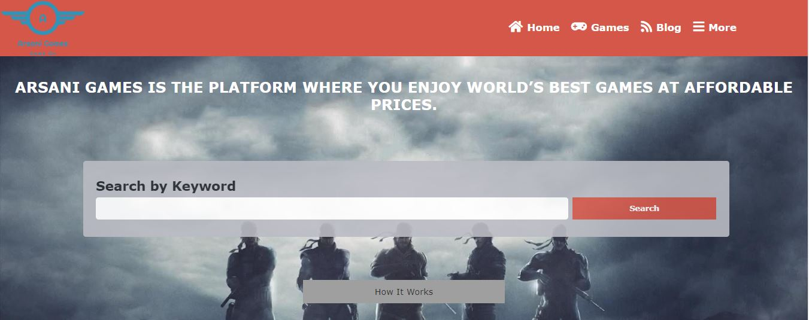
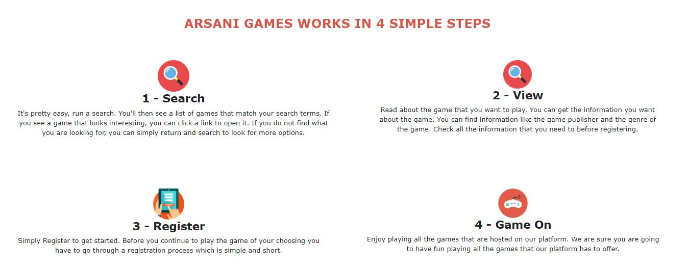
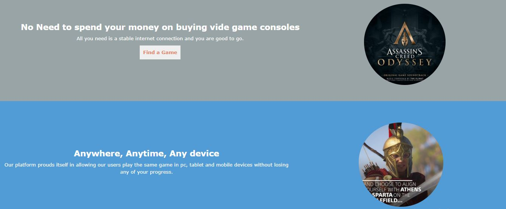

# arsani-games-capstone

# HTML & CSS3 Capstone Project

An online gaming website.This project has 3 pages, homepage, search games page, and game details page. It is responsive and has 3 breakpoints. 

### Home page card layout

<!--### Search page layout

-->

## Technologies used in this Project

## Live Demo

[Live demo link](https://samarsanios.github.io/arsani-games-capstone/)

## Getting Started

To get a local copy up and running follow these simple steps.

- `git clone https://github.com/SamArsanios/arsani-games-capstone`
- `cd arsani-games-capstone`
- `git checkout -b project-capstone`
- `git pull origin project-capstone`
- If you have vscode `live-server` installed, run it`

## Authors

👤 **Samson Kibrom**

- GitHub: [@SamArsanios](https://github.com/SamArsanios)
- Twitter: [@SamArsanios](https://twitter.com/SamArsanios)

## 🤝 Contributing

Contributions, issues, and feature requests are welcome!

## Show your support

Give a ⭐️ if you like this project!

## Acknowledgments

- [Sam Achola and Matthew Njuguna](https://www.behance.net/gallery/25563385/PatashuleKE) for the project guidelines.
- [Microverse](https://www.microverse.org/) for their `README` [template](https://github.com/microverseinc/readme-template).

<!--## 📝 License-->

